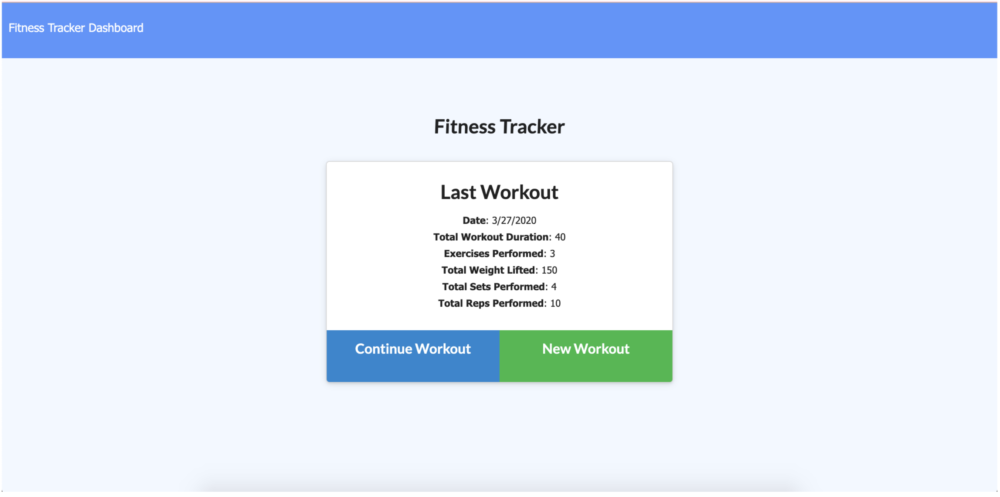
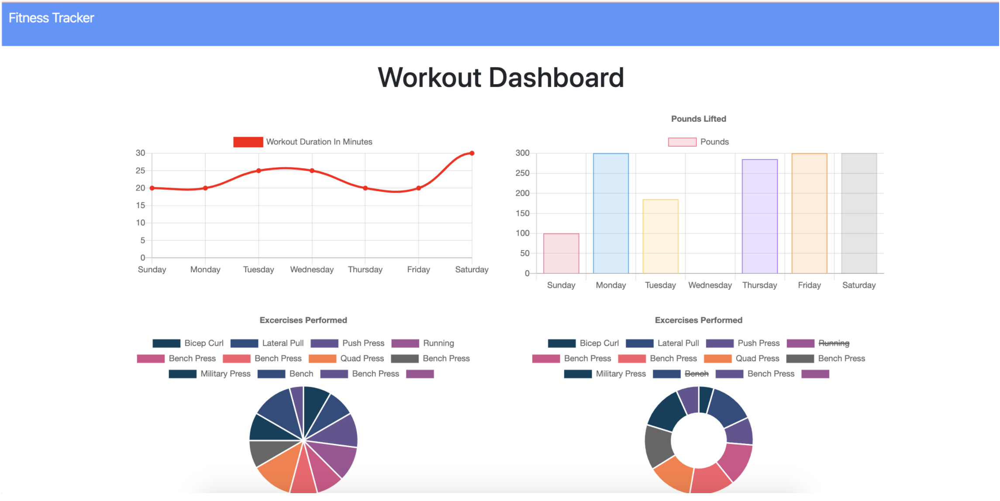

# Fitness Tracker

## Overview

Fitness Tracker is a full stack, MongoDB application to view and track daily workouts. It is able to log multiple exercises in a workout on a given day and  able to track stats for each exercise.  The NoSQL database will keep track of their daily details such as: number of reps, sets, distance,  and elapsed time. The data sets vary depending on whether the exercise is cardio or weight training. The dashboard uses charts and graphs to help users monitor their progress.  This app is built using a Mongo database with a Mongoose schema, Express route handling, and Vanilla Javascript.

## Utilizing the App

- Experience the deployed app on Heroku: [Here](https://nmcconnell-fitnesstracker.herokuapp.com/ "Here")
- When the user loads the page, they are given the option to create a new workout, or continue with their last workout. The user is able to:
  - Add exercises to a previous workout plan.
  - Add new exercises to a new workout plan.
  - View multiple the combined weight of multiple exercises on the stats page.

## Demonstration

## Tech used

- HTML
- CSS
- Bootstrap
- Javascript
- Node.js
- Express
- MongoDB
- Mongoose
- Canvas.js

## Contributers

- Nicholas McConnell
